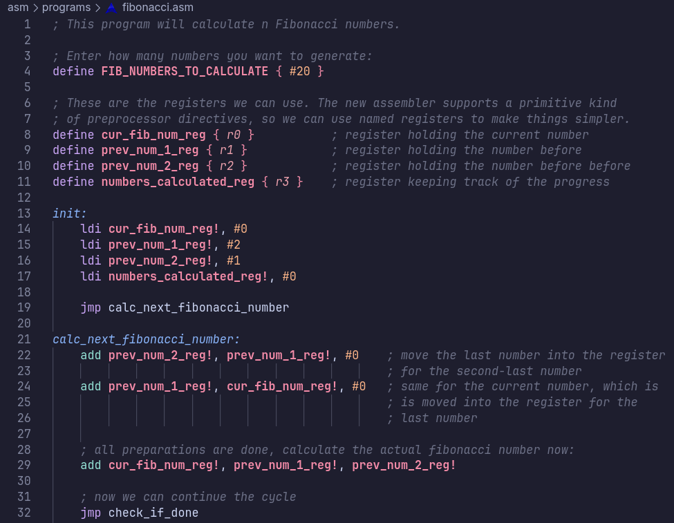

<p align="center">
    
    <h1 align="center">JoltCore Spark 16 (JC16)</h1>
</p>

This originally was a fun little project I did in 2 weeks on vacation, however it has now been expanded with many more hours invested into it. It is an **evolution of my original 8-bit CPU** which is now **16 bits**, has **8 general purpose 16 bit registers**, I/O ports, up to **128KiB RAM and 192KiB ROM**, basic maths and logical instructions, a fairly mature assembler, basic and performant emulator written in C++ and much more.

> [!IMPORTANT]  
> The entire CPU is a custom design - from bit shifter over wire layout to ISA.
>
> **In the winter of 2024 and 2025, it was improved further** by
> adding some optimizations in the context of a school project mentored
> by _Steve Furber_, co-developer of the original ARM architecture.

This project is thoroughly documented. You can [**read the docs here**](./docs/index.md).

The project also features an **own instruction set architecture**. Key features are:

- support for **8-bit immediates in every ALU instruction**:
    ```
    add r0, r1, #3
    lshift r2, #2, r3
    ```
- **encapsulated operations**, so you can calculate two things at once and **apply modifications to your ALU operands**:
    ```
    sub r4 (add r2 r3) r1
    nand r5 r1 (not r0)
    ```
- **3-bit immediates** in all of said encapsulated operations:
    ```
    nor r1 (sub r7 #5) r6
    ```
- fixed instruction length of **24 bits**
- LDI command to immediately load any arbitrary 16-bit value

The assembler tries to make coding as comfortable as possible:

- performs preprocessing and optimization
- it uses a custom assembly language that supports...
    - register notation with either digits (`r0`, `r2`, ...) or letters (`ra`, `rc`, ...)
    - named jumps and code blocks
    - pre-processor directives such as scoped `define` statements which allow you to use named registers and constants
    - comments
- detailed errors (with line numbers and descriptions) are thrown once problems are detected



You can find the assembler in the respective folder, `asm`. It is written in Python. To use an example program, assemble it and copy the entire content of the `.hex` file, then paste it into the ROM inside of Logisim Evolution (or try out the emulator). The source for these programs is inside of the `asm/programs` folder.

A command to assemble into all possible output formats, using debug output and optimizations could look like this:

```bash
./jcasm ./asm/programs/fibonacci.asm -o ./asm/build/fibonacci.out -dO -f bBrx
```

The emulator can be found in `emu`. It is written in C++. As of right now, only files exported from the assembler in the raw ROM format can be used. This is how it can be used:

```bash
./jcemu ./asm/build/fibonacci.out
```

> [!NOTE]
> You'll need Logisim Evolution, an open-source logic simulator, to use this project - it's available for download here:
> https://github.com/logisim-evolution/logisim-evolution/releases

---

**Have fun with it!**
