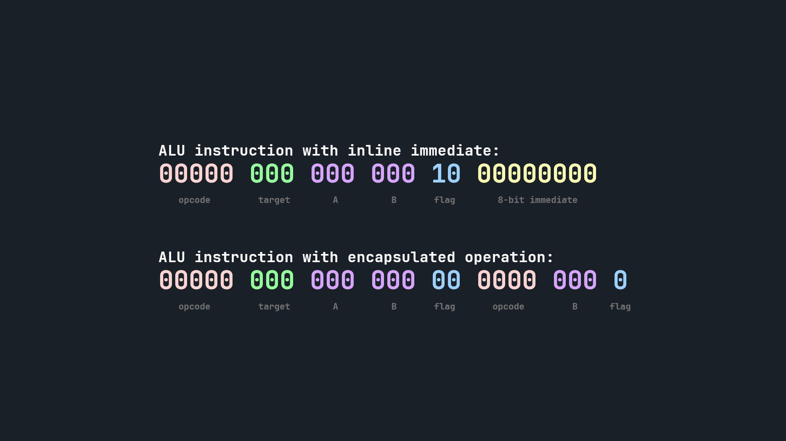

# Encapsulated operations

The ALU supports so-called encapsulated operations for all ALU functions. They can help increase IPC/throughput dramatically if used correctly.
Two-step formulas can be calculated all within one clock cycle. Together with parallelization, they can result in a total of 4x the "unoptimized" performance.



## Usage

In JC16 assembly (assembled by the JCASM), it is trivial to use these encapsulated operations by denoting them inside of parenthesis. You do not specify any target register, as there is none - the result is directly piped into the parent ALU instruction.

For example, to calculate...

$$c = a + \frac{b}{2}$$

... you can just use an encapsulated operation, which performs the effective calculation effort within one clock cycle:

```
main:
    ldi ra, #5                      ; prepare the register A ...
    ldi rb, #16                     ; ... along with register B
    add rc, ra, (rshift rb, #1)     ; this is where the tiny "magic" happens!
    halt
```
